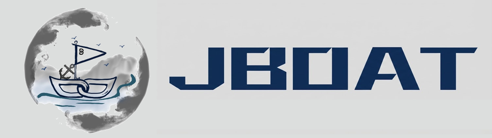

<h1 align="center">
  
</h1>
<p align="center">
  <b>A Compositional Operation Toolbox for Gradient-based Bi-Level Optimization</b><br>
  <br>
  <a href="https://jboat.readthedocs.io/en/latest/index.html">Home</a> |
  <a href="https://jboat.readthedocs.io/en/latest/install_guide.html#installation">Installation</a> |
  <a href="https://jboat.readthedocs.io/en/latest/jboat.html">Docs</a> |
  <a href="https://jboat.readthedocs.io/en/latest/install_guide.html#how-to-use-boat">Tutorials</a> |
  <a href="https://jboat.readthedocs.io/en/latest/index.html#running-example">Examples</a>
</p>

<div align="center">

[](https://badge.fury.io/py/boat-jit)


</div>

**JBOAT** is a compositional **O**per**A**tion-level **T**oolbox for gradient-based **B**LO.
Unlike existing libraries that typically encapsulate fixed solver routines, JBOAT factorizes the BLO workflow into **atomic, reusable primitives**. Through a unified constraint reconstruction perspective, it empowers researchers to **automatically compose** over **85+ solver variants** from a compact set of **17 gradient operations**.

This is the **Jittor-based** version of JBOAT (`jboat`). It leverages Jittor’s Just-In-Time (JIT) compilation and efficient CUDA/cuDNN backends to significantly **accelerate large-scale gradient-based BLO experiments**.

JBOAT supports unified execution across backends via separate branches:
- **[PyTorch-based](https://github.com/callous-youth/BOAT)**: The widely-used standard version.
- **[MindSpore-based](https://github.com/callous-youth/BOAT/tree/boat_ms)**: Optimized for ascending chips and industry scenarios.

<p align="center">
  <a href="https://github.com/callous-youth/BOAT">
    
  </a>
</p>

## 🔑 Key Features

* **🧩 Compositional Operation-Level Abstraction**: Deconstructs BLO solvers into three modular stages: *Gradient Mapping (GM)*, *Numerical Approximation (NA)*, and *First-Order (FO)*.
* **⚡ Accelerated JIT Execution**: Built on Jittor, enabling meta-operator fusion and high-performance execution on NVIDIA GPUs.
* **🏭 Generative Solver Construction**: Supports dynamic serialization of operations. Users can recover classical algorithms or discover **novel hybrid solvers** simply by changing configurations.
* **🛠 Configuration-Driven**: Define complex optimization strategies via simple `JSON` configurations, decoupling algorithmic logic from model definitions.
* **✅ Comprehensive Testing**: Achieves **99% code coverage** through rigorous testing with **pytest**, ensuring software robustness.

## 📚 Supported Operation Libraries

<div align="center">

JBOAT implements **17 atomic gradient operations** organized into three modular libraries. These primitives can be dynamically serialized to generate over **85+ solver variants**, covering the full spectrum of BLO methodologies.

| Library | Functional Role | Supported Atomic Operations |
| :--- | :--- | :--- |
| **GM-OL**<br>*(Gradient Mapping)* | **Reconstructs the LL iterative trajectory.**<br>Customizes the dynamic mapping rules ($\mathcal{T}_k$) to shape the optimization path and variable coupling. | • **[NGD](https://arxiv.org/abs/1706.02692)** (Naive Gradient Descent)<br>• **[GDA](https://arxiv.org/abs/2006.04045)** (Gradient Descent Aggregation)<br>• **[DI](https://proceedings.neurips.cc/paper/2021/hash/48bea99c85bcbaaba618ba10a6f69e44-Abstract.html)** (Dynamic Initialization)<br>• **[DM](https://proceedings.mlr.press/v202/liu23y.html)** (Dual Multiplier / KKT) |
| **NA-OL**<br>*(Numerical Approx.)* | **Resolves the auxiliary gradient bottleneck.**<br>Approximates the implicit gradients or hyper-gradients via automatic differentiation, numerical inversion, or truncation. | • **[RAD](https://proceedings.mlr.press/v70/franceschi17a.html)** (Reverse-AD / Unrolled)<br>• **[RGT](https://arxiv.org/abs/1810.10667)** (Reverse Gradient Truncation)<br>• **[PTT](https://proceedings.neurips.cc/paper/2021/hash/48bea99c85bcbaaba618ba10a6f69e44-Abstract.html)** (Pessimistic Trajectory Truncation)<br>• **[FD](https://arxiv.org/abs/1806.09055)** (Finite Difference / DARTS)<br>• **[CG](https://arxiv.org/abs/1602.02355)** (Conjugate Gradient)<br>• **[NS](https://proceedings.mlr.press/v108/lorraine20a.html)** (Neumann Series)<br>• **[IGA](https://ieeexplore.ieee.org/document/10430445)** (Implicit Gradient Approximation)<br>• **[IAD](https://arxiv.org/abs/1703.03400)** (Init-based AD / MAML)<br>• **[FOA](https://arxiv.org/abs/1803.02999)** (First-Order Approx. / Reptile) |
| **FO-OL**<br>*(First-Order)* | **Constructs single-level surrogates.**<br>Reformulates the nested problem into first-order objectives using value-functions or penalties, avoiding Hessian computations. | • **[VSO](http://proceedings.mlr.press/v139/liu21o.html)** (Value-Function Sequential)<br>• **[VFO](https://proceedings.neurips.cc/paper_files/paper/2022/hash/6dddcff5b115b40c998a08fbd1cea4d7-Abstract-Conference.html)** (Value-Function First-Order)<br>• **[MESO](https://arxiv.org/abs/2405.09927)** (Moreau Envelope)<br>• **[PGDO](https://proceedings.mlr.press/v202/shen23c.html)** (Penalty Gradient Descent) |

</div>

## 🔨 Installation

JBOAT is built on top of **Jittor**. Please ensure Jittor is installed correctly before installing JBOAT.

### 1. Install Jittor
Follow the [Official Installation Guide](https://cg.cs.tsinghua.edu.cn/jittor/download/) or use the commands below:

**Linux (Ubuntu / CentOS)**

```bash
sudo apt install python3.8-dev libomp-dev
python3.8 -m pip install jittor
# Verify installation (Optional)
python3.8 -m jittor.test.test_example
```

**Windows**

```bash
python -m pip install jittor
python -m jittor.test.test_core
```

**macOS**

```bash
brew install libomp
python3.8 -m pip install jittor
```

### 2. Install jboat
Once Jittor is ready, install jboat via PyPI or Source:
```bash
# Install from PyPI
pip install jboat

# Or install from Source (Specific Branch)
git clone https://github.com/vis-opt-group/JBOAT.git
cd JBOAT
pip install -e .
```

## ⚡ How to Use JBOAT

JBOAT separates the **problem definition** from the **solver configuration**. Below is a Jittor-based example.

### 1. Load Configurations

```python
import json
import jboat as boat

# Load algorithmic configurations
with open("configs/boat_config.json", "r") as f:
    boat_config = json.load(f)

# Load objective configurations
with open("configs/loss_config.json", "r") as f:
    loss_config = json.load(f)
```

### 2. Define Models and Optimizers

Use standard Jittor models and optimizers.

```python
import jittor as jit

# Define models
upper_model = MyUpperModel()
lower_model = MyLowerModel()

# Define optimizers (Jittor syntax)
upper_opt = jit.nn.Adam(upper_model.parameters(), lr=1e-3)
lower_opt = jit.nn.SGD(lower_model.parameters(), lr=1e-2)
```

### 3. Customize & Initialize Problem

Inject runtime objects into the configuration.

```python
# Configure JBOAT with Jittor models/optimizers
boat_config["lower_level_model"] = lower_model
boat_config["upper_level_model"] = upper_model
boat_config["lower_level_opt"] = lower_opt
boat_config["upper_level_opt"] = upper_opt

# Initialize the JBOAT core
b_optimizer = boat.Problem(boat_config, loss_config)
```


### 4. Build Solvers

Inject runtime objects into the configuration.

```python
# Pass optimizers explicitly if needed by the solver backend
b_optimizer.build_ll_solver(lower_opt)
b_optimizer.build_ul_solver(upper_opt)
```

### 5. Run Optimization Loop

```python
# Training loop
for x_itr in range(1000):
    # Prepare data (Jittor Arrays or dicts)
    ul_feed_dict = {"data": ul_data, "target": ul_target}
    ll_feed_dict = {"data": ll_data, "target": ll_target}
    
    # Run one iteration
    loss, run_time = b_optimizer.run_iter(ll_feed_dict, ul_feed_dict, current_iter=x_itr)
    
    if x_itr % 100 == 0:
        print(f"Iter {x_itr}: UL Loss {loss:.4f}")
```

## 🌍 Applications

JBOAT covers a wide spectrum of BLO applications, categorized by the optimization target:

* **Data-Centric**: Data Hyper-Cleaning, Synthetic Data Reweighting, Diffusion Model Guidance.
* **Model-Centric**: Neural Architecture Search (NAS), LLM Prompt Optimization, Parameter Efficient Fine-Tuning (PEFT).
* **Strategy-Centric**: Meta-Learning, Hyperparameter Optimization (HO), Reinforcement Learning from Human Feedback (RLHF).

## 📝 Citation

If you find JBOAT useful in your research, please consider citing our paper:

```bibtex
@article{liu2025boat,
  title={BOAT: A Compositional Operation Toolbox for Gradient-based Bi-Level Optimization},
  author={Liu, Yaohua and Pan, Jibao and Jiao, Xianghao and Gao, Jiaxin and Liu, Zhu and Liu, Risheng},
  journal={Submitted to Journal of Machine Learning Research (JMLR)},
  year={2025}
}
```

## License

MIT License

Copyright (c) 2024 Yaohua Liu

Permission is hereby granted, free of charge, to any person obtaining a copy
of this software and associated documentation files (the "Software"), to deal
in the Software without restriction, including without limitation the rights
to use, copy, modify, merge, publish, distribute, sublicense, and/or sell
copies of the Software, and to permit persons to whom the Software is
furnished to do so, subject to the following conditions:

The above copyright notice and this permission notice shall be included in all
copies or substantial portions of the Software.

THE SOFTWARE IS PROVIDED "AS IS", WITHOUT WARRANTY OF ANY KIND, EXPRESS OR
IMPLIED, INCLUDING BUT NOT LIMITED TO THE WARRANTIES OF MERCHANTABILITY,
FITNESS FOR A PARTICULAR PURPOSE AND NONINFRINGEMENT. IN NO EVENT SHALL THE
AUTHORS OR COPYRIGHT HOLDERS BE LIABLE FOR ANY CLAIM, DAMAGES OR OTHER
LIABILITY, WHETHER IN AN ACTION OF CONTRACT, TORT OR OTHERWISE, ARISING FROM,
OUT OF OR IN CONNECTION WITH THE SOFTWARE OR THE USE OR OTHER DEALINGS IN THE
SOFTWARE.
